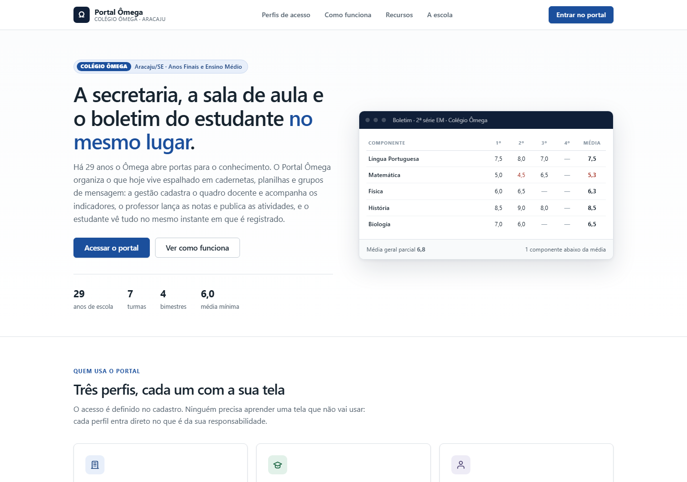
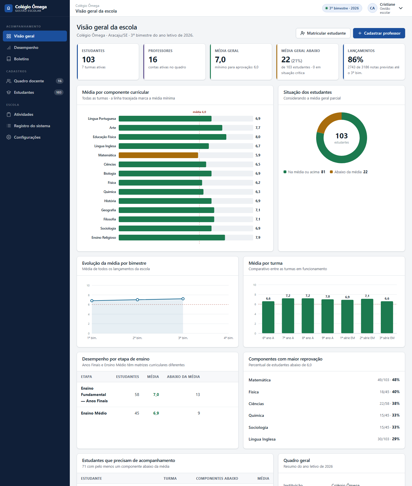
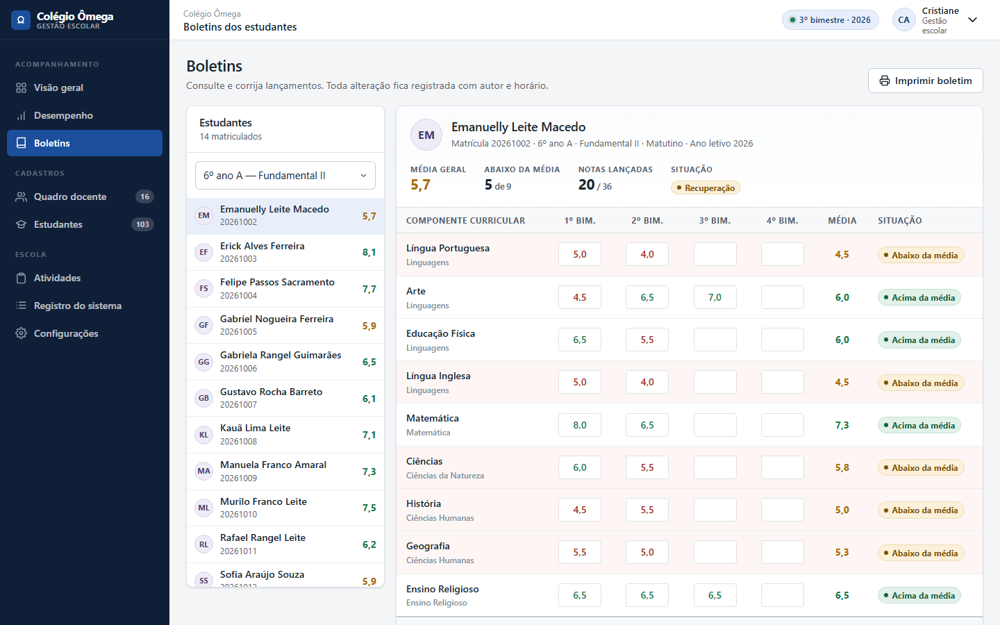
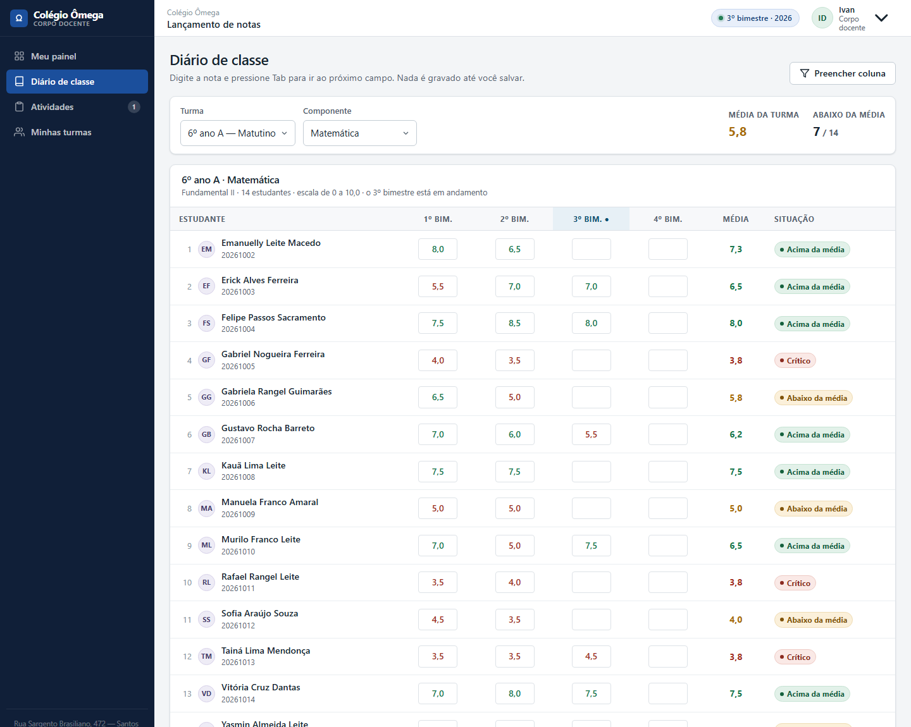
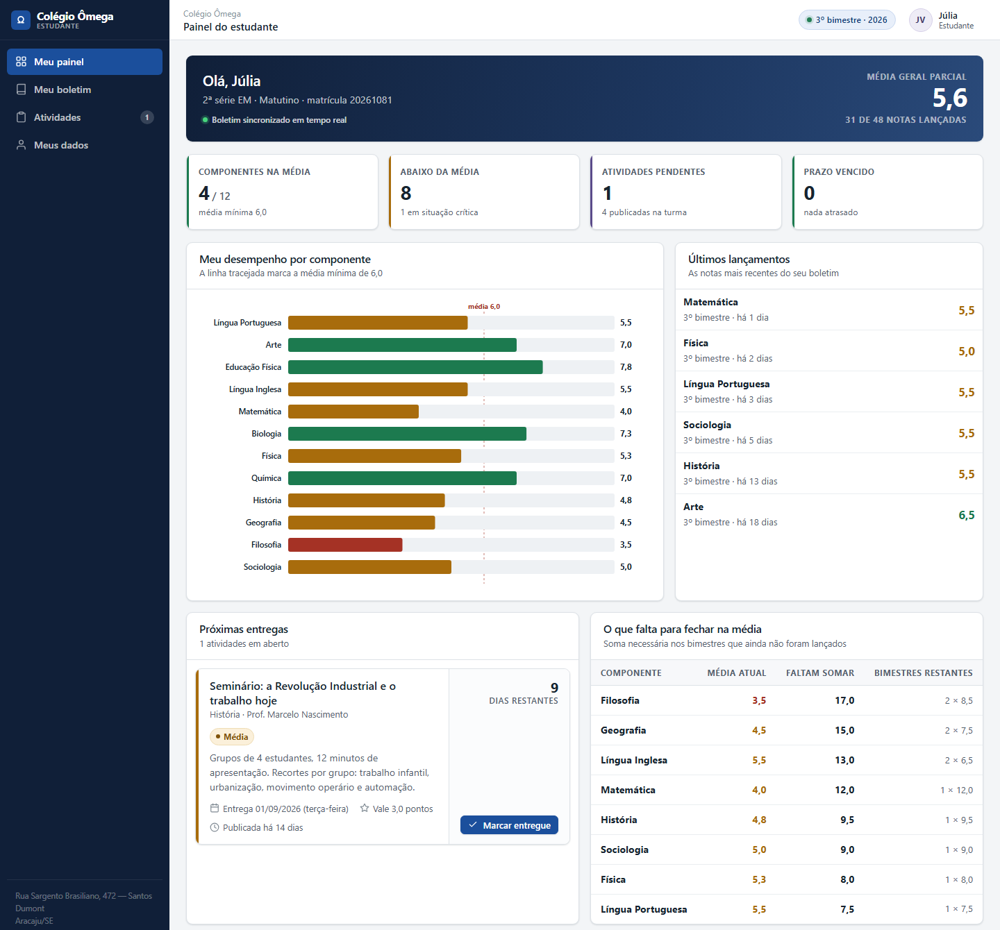
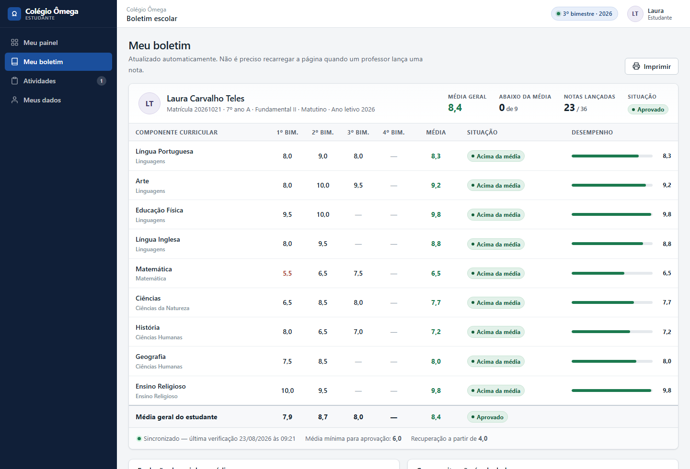
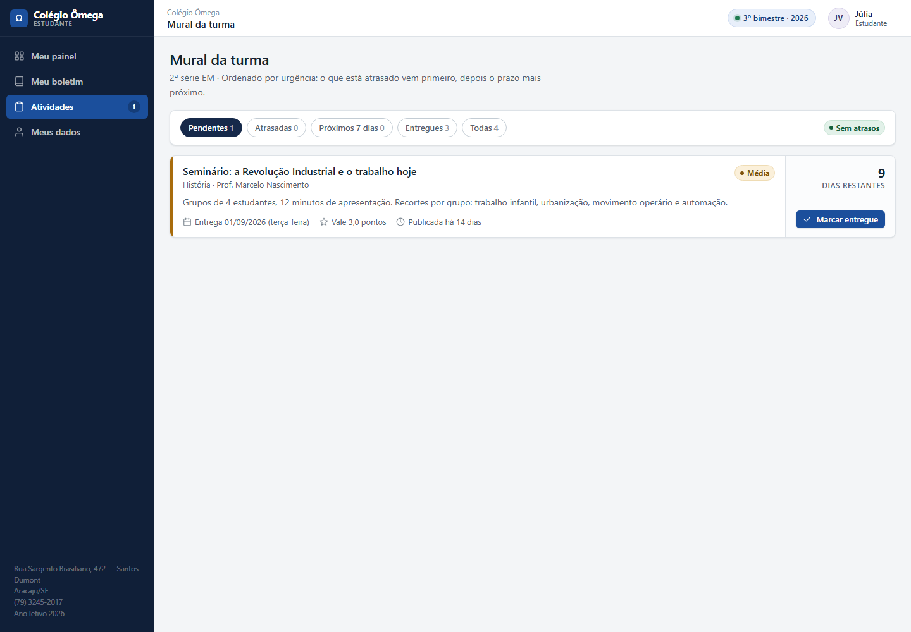
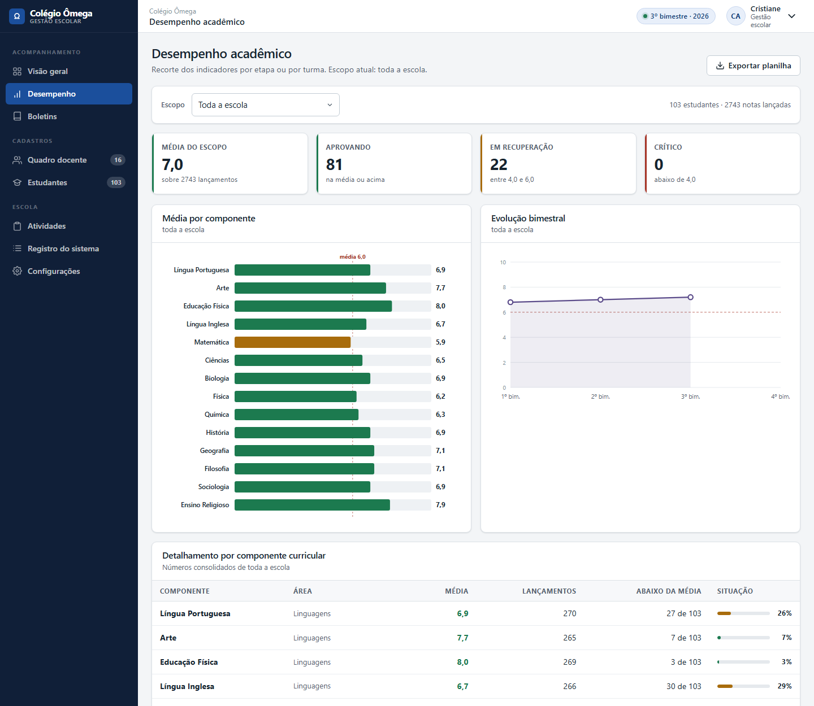

# Portal Ômega — Sistema Acadêmico

Sistema escolar completo para o **Colégio Ômega** (Aracaju/SE), escrito em **HTML, CSS e
JavaScript puro** — sem framework, sem build, sem dependência externa. Abre num duplo clique
ou em qualquer servidor estático.

Cobre as duas etapas que trabalham com boletim bimestral na escola: **Anos Finais do Ensino
Fundamental (6º ao 9º ano)** e **Ensino Médio (1ª a 3ª série)**.



---

## Índice

- [O que o sistema faz](#o-que-o-sistema-faz)
- [Como usar](#como-usar)
- [Contas de demonstração](#contas-de-demonstração)
- [Telas](#telas)
- [Regras acadêmicas](#regras-acadêmicas)
- [Matrizes curriculares](#matrizes-curriculares)
- [Como a atualização em tempo real funciona](#como-a-atualização-em-tempo-real-funciona)
- [Estrutura do projeto](#estrutura-do-projeto)
- [Onde os dados ficam](#onde-os-dados-ficam)
- [Testes](#testes)
- [Limitações conhecidas](#limitações-conhecidas)
- [Aviso](#aviso)

---

## O que o sistema faz

Três perfis de acesso, cada um com a sua própria área.

### Gestão escolar

- Cadastra contas de **professores**, definindo formação, regime, turmas e quais componentes
  cada um leciona.
- **Matricula estudantes**, com matrícula gerada automaticamente, turma, responsável e contato.
- Abre o **boletim de qualquer estudante** e corrige notas direto na célula — toda alteração
  fica registrada com autor, horário e valor anterior.
- Painel com **média por componente**, distribuição de situação, evolução por bimestre,
  comparativo entre turmas e entre etapas, e a lista nominal de quem precisa de recuperação.
- Ficha completa de cada conta docente, com redefinição de senha e **acesso assistido**
  (abrir o sistema como aquela pessoa, com aviso na tela e registro em auditoria).
- Configurações da escola: identificação, turmas, regras de avaliação, exportação em CSV e
  cópia de segurança da base.

### Corpo docente

- **Diário de classe** com todos os estudantes da turma e as quatro colunas bimestrais.
  Navegação por teclado, média e situação recalculadas enquanto se digita, e gravação em lote.
- O seletor só oferece **os componentes que aquele professor leciona naquela turma** — a
  matriz muda entre Anos Finais e Ensino Médio, e o sistema respeita isso sozinho.
- "Preencher coluna" para atribuir uma nota base a toda a turma antes dos ajustes individuais.
- **Publicação de atividades** com título, orientações, prazo, prioridade, valor em pontos,
  link de apoio e imagens anexadas.
- Painel com pendências de lançamento do bimestre corrente e estudantes abaixo da média.

### Estudante

- **Boletim que se atualiza sozinho**: quando o professor salva, a nota aparece na hora,
  destacada, com um aviso dizendo qual componente mudou.
- Média parcial mesmo com bimestres em aberto e **quanto ainda falta somar** para fechar o
  ano na média em cada componente.
- **Mural de atividades** ordenado por urgência real (atrasadas primeiro, depois o prazo mais
  próximo, e a prioridade como critério de desempate), com marcação de entrega.

---

## Como usar

Não precisa instalar nada.

```bash
git clone https://github.com/<usuario>/portal-colegio-omega.git
cd portal-colegio-omega
```

Depois, escolha uma das opções:

1. **Duplo clique** em `index.html`.
2. Servidor local (recomendado, e é o mesmo cenário do GitHub Pages):

```bash
python -m http.server 8000
# ou
npx serve .
```

E abra <http://localhost:8000>.

Na primeira visita o sistema cria sozinho uma base de demonstração com 7 turmas,
103 estudantes, 16 professores e mais de 2 mil notas lançadas.

---

## Contas de demonstração

A página inicial mostra as credenciais válidas e tem botões que preenchem o formulário com
um clique. As senhas padrão são:

| Perfil | Senha | Como entrar |
| --- | --- | --- |
| Gestão | `gestor123` | e-mail institucional ou matrícula |
| Professor | `prof123` | e-mail institucional ou matrícula |
| Estudante | `aluno123` | e-mail ou número da matrícula |

> Os nomes e e-mails são gerados na primeira execução — por isso a página inicial lista as
> contas reais da sua base, em vez de valores fixos neste README.

**Para ver o tempo real funcionando:** abra o professor numa aba e o estudante em outra
(a sessão é por aba). Lance uma nota no diário, salve, e olhe a aba do estudante.

---

## Telas

### Painel da gestão



### Boletim com edição pela direção



### Diário de classe do professor



### Painel do estudante



### Boletim do estudante



### Mural de atividades



### Desempenho por etapa e por turma



---

## Regras acadêmicas

- Escala de **0 a 10**, quatro bimestres.
- **Média mínima para aprovação: 6,0.** Recuperação a partir de 4,0; abaixo disso a situação
  é considerada crítica.
- A média de um componente é a média aritmética dos bimestres **já lançados** — bimestres em
  branco não entram na conta, o que permite acompanhar o ano em andamento.
- Toda média é arredondada para **uma casa decimal antes de virar situação**, para que o
  número exibido na tela seja exatamente o número que o sistema comparou com a média mínima.
- A média geral do estudante é a média das médias dos componentes com nota lançada.

Média mínima, nota de recuperação, ano letivo e bimestre corrente são editáveis pela direção
em **Configurações**.

---

## Matrizes curriculares

As duas etapas têm componentes diferentes, e o sistema trata isso em todo lugar: boletim,
diário, gráficos, planilha exportada e formulário de atividade.

| Componente | Anos Finais | Ensino Médio |
| --- | :---: | :---: |
| Língua Portuguesa | ● | ● |
| Arte | ● | ● |
| Educação Física | ● | ● |
| Língua Inglesa | ● | ● |
| Matemática | ● | ● |
| História | ● | ● |
| Geografia | ● | ● |
| Ciências | ● | — |
| Ensino Religioso | ● | — |
| Biologia | — | ● |
| Física | — | ● |
| Química | — | ● |
| Filosofia | — | ● |
| Sociologia | — | ● |
| **Total** | **9** | **12** |

No Ensino Médio entram apenas os componentes da **Formação Geral Básica**. Itinerários
formativos não geram nota no boletim.

---

## Como a atualização em tempo real funciona

Não existe servidor nem WebSocket. A sincronia acontece entre as abas do mesmo navegador:

1. Uma tela grava na base (`localStorage`).
2. `dados.js` emite a mudança num **`BroadcastChannel`**, com o evento **`storage`** como
   plano B para navegadores sem suporte.
3. As outras abas recarregam o estado e avisam quem estiver inscrito.
4. A tela do estudante compara o retrato anterior das notas com o novo, descobre exatamente
   o que mudou, dispara o aviso e destaca a célula.

A sessão fica em `sessionStorage` de propósito: assim **cada aba pode estar logada com um
usuário diferente**, que é o que torna a demonstração possível numa máquina só.

---

## Estrutura do projeto

```
.
├── index.html              Página pública e tela de acesso
├── gestor.html             Área da gestão escolar
├── professor.html          Área do corpo docente
├── aluno.html              Área do estudante
├── assets/
│   ├── css/
│   │   ├── base.css        Variáveis de cor, reset, tipografia
│   │   ├── componentes.css Botões, formulários, tabelas, modais, avisos
│   │   ├── app.css         Estrutura interna (topo, menu lateral, conteúdo)
│   │   ├── modulos.css     Boletim, atividades, diário de classe
│   │   └── portal.css      Página pública
│   ├── js/
│   │   ├── nucleo.js       DOM, formatação, ícones, modais, notificações
│   │   ├── semente.js      Carga inicial de demonstração
│   │   ├── dados.js        Camada de dados, sincronia e estatísticas
│   │   ├── sessao.js       Autenticação e controle de acesso
│   │   ├── graficos.js     Gráficos em SVG escritos à mão
│   │   ├── casca.js        Estrutura comum das telas internas
│   │   ├── boletim.js      Montagem da tabela de boletim
│   │   ├── atividades.js   Cartão de atividade, formulário e anexos
│   │   ├── portal.js       Página pública
│   │   ├── gestor.js       Telas da gestão
│   │   ├── professor.js    Telas do corpo docente
│   │   └── aluno.js        Telas do estudante
│   └── img/favicon.svg
└── docs/capturas/          Imagens usadas neste README
```

Nenhum arquivo depende de rede: os ícones são SVG embutidos, os gráficos são desenhados à
mão em SVG e a tipografia usa a fonte do sistema.

---

## Onde os dados ficam

Tudo no **armazenamento local do navegador**, em três chaves:

| Chave | Conteúdo |
| --- | --- |
| `omega.base.v1` | Base completa: usuários, notas, atividades, auditoria |
| `omega.arquivos.v1` | Anexos das atividades (imagens reduzidas e recomprimidas) |
| `omega.sessao.v1` | Sessão da aba atual (`sessionStorage`) |

Consequências práticas:

- Limpar os dados de navegação **apaga a base**. Antes de apresentar, gere uma cópia em
  *Configurações → Baixar cópia de segurança*.
- Nada sai da máquina. Nenhuma requisição é feita para servidor nenhum.
- Imagens anexadas são redimensionadas para no máximo 1400 px e recomprimidas antes de serem
  gravadas — sem isso, duas fotos de celular estourariam a cota do navegador.

---

## Testes

O projeto tem uma bateria de verificações da camada de dados que roda fora do navegador
(Node, sem dependências) e um *smoke test* que abre todas as telas no Chrome headless e
falha se qualquer uma registrar erro de JavaScript.

Estado atual:

- **138 verificações** da camada de dados — identificação da escola, matrizes por etapa,
  integridade das notas, login, boletim, lançamento e correção, cadastro de contas,
  atividades, estatísticas, classificação, formatação, exportação e persistência.
- **26 telas** abertas no navegador sem nenhum erro de console.

---

## Limitações conhecidas

São escolhas conscientes de um projeto sem servidor, e estão documentadas para não passarem
por descuido:

- **As senhas não têm proteção criptográfica real.** São guardadas como um resumo com sal
  (FNV-1a duplo) só para não ficarem em texto puro no navegador. Num sistema em produção isso
  ficaria no servidor, com bcrypt ou argon2.
- **Não há multiusuário de verdade.** A "sincronia em tempo real" acontece entre abas do
  mesmo navegador, não entre computadores diferentes.
- **Sem controle de frequência, plano de aula ou financeiro.** O escopo é cadastro, notas,
  boletim e atividades.
- A base cabe folgado no `localStorage` (cerca de 1 MB com os dados de demonstração), mas o
  espaço para anexos é limitado a ~3,5 MB.

---

## Aviso

Este é um **projeto acadêmico independente**, sem vínculo oficial com o Colégio Ômega.

Os dados institucionais (nome, endereço, telefone, código INEP e data de fundação) são
registros públicos. Já **todas as pessoas do sistema — gestores, professores e estudantes —
são fictícias**, geradas por um algoritmo com semente fixa. Nenhum dado real de aluno,
responsável ou funcionário foi utilizado.

---

<sub>Colégio Ômega · Rua Sargento Brasiliano, 472 — Santos Dumont, Aracaju/SE ·
(79) 3245-2017 · [@colegioomegaaracaju](https://www.instagram.com/colegioomegaaracaju/)</sub>
